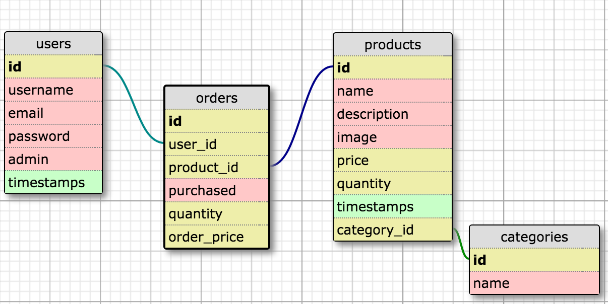

## Bullzeye
URL: https://bullzeye.herokuapp.com/

## Description
- Rails-based Online Shop

### MOCK UPS

### SCHEMA

-

### Workflow

### MVP Iteration 1
- Client can view products :heavy_check_mark:
- Client can enter products :heavy_check_mark:
- Client can manage products :heavy_check_mark:
- Client sees a basic styled website :heavy_check_mark:
- Client can see product placeholders :heavy_check_mark:

### MVP Iteration 2
- Bootstrap/flash errors :heavy_check_mark:
- Client can add quantity :heavy_check_mark:
- Client sees formatted prices :heavy_check_mark:
- Client has to authenticate to CUD :heavy_check_mark:
- User can view products without authentication :heavy_check_mark:

### MVP Iteration 3
- User/Client can login using session-based authentication :heavy_check_mark:
- User receives welcome email after signing up
- Client can view categories of products :heavy_check_mark:
- Client can view products by category :heavy_check_mark:
- Product show page includes categories :heavy_check_mark:

### MVP Iteration 4
- User can click button to add product to cart :heavy_check_mark:
- User can view cart items via AJAX
- User can specify the quantity of products in the cart (restricted by product stock quantity) :heavy_check_mark:
- User can remove a product from the cart :heavy_check_mark:
- User can see the current total price of items in their cart as items are added or removed
- User can checkout :heavy_check_mark:
- Product stock quantity is reduced by the amount purchased after checkout :heavy_check_mark:
- User is redirected to a page thanking them :heavy_check_mark:
and listing their purchases after checkout
- User receives an email thanking them and listing their purchases after checkout
- User cannot add product to cart if it is out of stock :heavy_check_mark:
- User can view their order history
